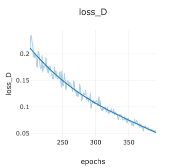
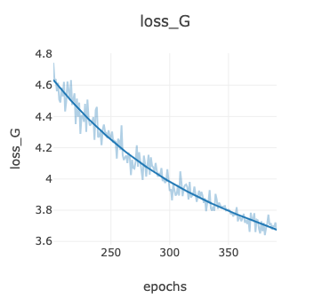
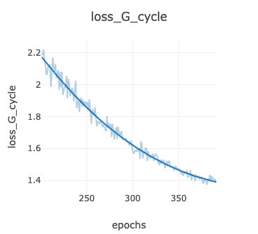
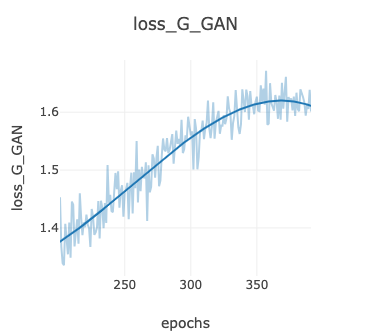
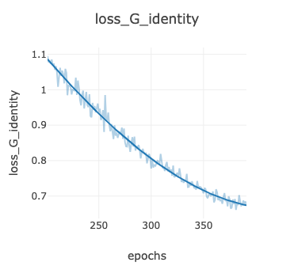

# CycleGAN-Fitzpatrick

## Overview
A [CycleGAN](https://arxiv.org/abs/1703.10593) model trained on [Diverse Dermatology Images (DDI)](https://ddi-dataset.github.io) from Daneshjou et al. ([https://doi.org/10.1126/sciadv.abq6147](https://doi.org/10.1126/sciadv.abq6147)), to transform dermatological images between Fitzpatrick I-II and V-VI categories, aimed at generalizing dermatological image analysis. The cGAN implementation was adapted from [Aitor Ruano](https://github.com/aitorzip/PyTorch-CycleGAN). 

This tool demonstrates data augmentation techniques for improving dataset diversity and model generalization across different demographic populations. While not intended for production use, this proof-of-concept implementation explores the potential benefits and limitations of this approach to data augmentation.

## Table of Contents
- [Installation](#installation)
- [Training](#dataset)
- [Testing](#dataset)
- [Results](#results)
- [Acknowledgments](#acknowledgments)

## Installation
1. Clone the repository:
   ```bash
   git clone https://github.com/advafaeian/cyclegan-fitzpatrick.git
   cd cyclegan-fitzpatrick
   ```
2. Install the required packages:
   ```bash
   pip install -r requirements.txt
   ```
3. Download the DDI dataset from [here](https://stanfordaimi.azurewebsites.net/datasets/35866158-8196-48d8-87bf-50dca81df965).
4. Extract the content in a folder named `ddi_dataset`.
5. Generate training dataset consisting of Fitzpatrick I-II and V-VI images:
   ```bash
   python prepare_dataset.py
   ```

## Training
To train the CycleGAN model, use the following commands:
```bash
# Initialize the Visdom server for monitoring
python -m visdom.server

# To start training from scratch
python train.py --dataroot ./ddi_dataset/train --cuda

# To resume training from the current weights
python train.py --dataroot ./ddi_dataset/train --resume --epoch 400 --n_epochs 600 --cuda
```
The following data are from the second 200 epochs. The data from the first 200 epochs can be found [here](./epochs_data/200/).








## Testing
After training or using the current weights, you can generate transformed result images by running:
```bash
python generate.py --dataroot './test_images'
```

### Results
Here are some example results from the model using images from the [ISIC dataset](https://gallery.isic-archive.com):


## Acknowledgments
- [CycleGAN](https://junyanz.github.io/pytorch-CycleGAN-and-pix2pix/) for the original implementation.
- [CycleGAN Clean Version](https://github.com/aitorzip/PyTorch-CycleGAN) for the refined implementation.
- [Diverse Dermatology Images](https://ddi-dataset.github.io) for the datasets used for training.
- Roxana Daneshjou et al. ,Disparities in dermatology AI performance on a diverse, curated clinical image set.Sci. Adv.8,eabq6147(2022).DOI:10.1126/sciadv.abq6147
- Test images from the [ISIC dataset](https://gallery.isic-archive.com), attributed to Hospital Italiano de Buenos Aires, used under the CC-BY license.

